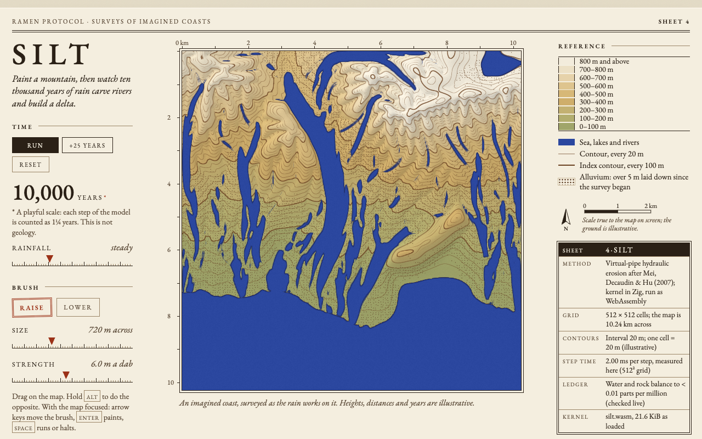

# silt

**Paint a mountain, watch 10,000 years of rain carve river valleys and build small deltas where the rivers reach the sea.**



silt is a hydraulic-erosion model drawn as a geological survey sheet. The whole
simulation, and the drainage survey that traces its rivers, is written in Zig
and runs in your browser as a 32 KiB WebAssembly module. JavaScript only
handles the controls and draws the map straight from the kernel's memory.

## The 30-second experience

1. The sheet opens on a procedurally generated coast: a mountain range in the
   north, a winding valley draining south, a coastal plain and a shallow sea.
   The rain starts by itself.
2. Within a few seconds the rivers appear, drawn as ultramarine lines that
   thicken downstream, and start cutting into the hills.
3. Where the biggest rivers reach the sea they drop their load. Pale new land
   and stipple (alluvium) build out at those mouths, and the waterlines along
   the coast bend around it. On the default map two deltas grow, and they are
   **modest**: roughly 300–400 m of new coast (15–20 cells) by the end of the run.
4. At 10,000 (playful) years the run halts with a note. Paint, then press
   **Run** to keep going.
5. Drag on the map to raise ground (or switch to **Lower**, or hold <kbd>Alt</kbd>).
   One drag with the default brush (720 m across, 20 m a dab) raises a ridge
   roughly 80–100 m high (measured on the page), enough to bend the contours
   and push a river aside at once. Dabs are spaced along the path, so a quick
   drag paints as much as a slow one.
   A small painted hill mostly rounds off; a broad painted range under heavy
   rain grows gullies and pushes its own row of small deltas into the sea.
6. Export the terrain as a **16-bit greyscale PNG heightmap**, or save the map view.

Keyboard: with the map focused, the arrow keys move the brush (Shift for bigger
jumps), <kbd>Enter</kbd> paints, <kbd>Shift</kbd>+<kbd>Enter</kbd> paints the
opposite way, <kbd>[</kbd>/<kbd>]</kbd> change the size and <kbd>Space</kbd>
runs or halts. With `prefers-reduced-motion`, nothing animates and nothing
starts by itself: the Run button becomes **+1,000 years**, which jumps ahead
and draws once.

## How it works

### The physics (Zig, `src/sim.zig`)

The method is the grid-based **virtual-pipe model** of Mei, Decaudin & Hu,
*Fast Hydraulic Erosion Simulation and Visualization on GPU* (Pacific Graphics
2007). Water sits in cells and moves through four virtual pipes to its
neighbours, driven by differences in water-surface height. The flow sets a
velocity field, the velocity sets how much sediment the water can carry, and
each cell erodes or deposits towards that capacity. Each step:

1. **rain** on land (more on high ground, in passing showers from a seeded PRNG);
2. **flux** through the pipes, scaled so no cell sends more water than it holds;
3. **water**: depth and velocity from the fluxes, and the sediment capacity;
4. **erode**: pick up or lay down sediment towards capacity;
5. **transport** the suspended sediment with the water, then **evaporate**;
6. **slump + creep**: thermal weathering (talus slumping, after Musgrave,
   Kolb & Mace, *The synthesis and rendering of eroded fractal terrains*,
   SIGGRAPH 1989) and a light linear creep;
7. hold the **sea** at sea level.

Changes from the paper, each made for a reason you can see on the map (they are
also documented at the top of `src/sim.zig`):

- **Conservative sediment transport.** Sediment moves with the same pipe fluxes
  as the water (a finite-volume, donor-cell scheme) instead of semi-Lagrangian
  advection. Every source and sink is booked: rain, evaporation, sea exchange,
  water and sediment that run off the map, painting, and the material picked
  up from and laid down on the bed.
- **Stream-power capacity.** Capacity is tilt × speed × min(depth, d_ref) above
  a threshold, averaged over 3×3 cells (which stops one-cell rills on a fine
  grid). The threshold is high enough that thin sheet-wash on the plain moves
  nothing.
- **Deltas.** These changes are what make the rivers build land at their mouths:
  - *Base level.* Nothing is eroded below sea level, so a river cannot scour
    a drowned estuary.
  - *Dropping the load at sea.* In the sea, capacity dies away as
    exp(−depth / 0.3) and the load settles fast (Kd = 0.5).
  - *Carrying it across the plain.* On land, settling slows in deeper water:
    Kd / (1 + depth / 0.3). Grains take longer to fall through a deep channel,
    so a river carries its load across the plain to the sea, while a thin
    sheet drops it.
  - *A shoreface.* The sea floor drops to about 12 m within a few cells of the
    coast, so new land has to be built by a river's load, not by a film of
    sheet-wash filling a knee-deep margin.
- **Open land edges.** Beyond a land edge the ground continues the edge slope,
  so water runs off the map where the ground falls away (and ponds nowhere
  against the frame). What leaves is booked; sea edges stay closed.
- **Depth-dependent friction** and a **soft sea**, as before: sheet-wash stays
  calm, channels carry a lot, and a river's momentum carries past its mouth.

### The drainage survey (Zig, `src/hydro.zig`)

Rivers are not drawn from the water depth, which in a pipe model breaks into
lozenges and pools. Every 16 steps (and after painting) the kernel surveys the
drainage instead:

1. **Pit filling** with the Priority-Flood of Barnes, Lehman & Mulla,
   *Priority-Flood: An optimal depression-filling and watershed-labeling
   algorithm for digital elevation models* (Computers & Geosciences, 2014).
   The outlets are the sea's shore and the open land edges. The priority queue
   is a bucket queue over heights quantised to 1/128 of a unit, so it runs in
   linear time.
2. **D8 routing.** Each land cell drains to its steepest lower neighbour on the
   filled surface; across flats and filled pits it drains towards the cell the
   flood reached it from. Every chain ends at the sea or off the map.
3. **Flow accumulation**: the upstream area of every cell.
4. **Rivers.** Every cell draining more than 300 units² (0.12 km² at the
   page's scale) is a river cell. Trunk rivers (30 times that) are always
   drawn. Small streams are drawn only where the simulated water really runs:
   discharge above a threshold starts a stream, and half that keeps it going.
   So a stream can fade out on a fan instead of ruling a straight line down a
   plain it barely trickles across. The kernel emits line segments from each
   river cell to its receiver, with the corners of the D8 staircase rounded off.
5. **Lakes**: standing water deeper than 12 m in a filled pit.
6. **Distance to the coast** (signed, by "dead reckoning", Grevera 2004),
   seeded where the terrain crosses sea level, for the waterlines and the
   coastal stipple.

The survey is for drawing only; the physics never reads it.

### Engineering notes

- **No allocation per step.** All fields are flat arrays in static WebAssembly
  memory (20 `f32` fields of 514², plus the survey's queues and segment list,
  about 30 MB at 512²).
- **SIMD.** The hot loops use `@Vector(4, f32)`, which compiles to WebAssembly
  `simd128`. The same kernels are generic over the lane count, and a test
  checks that the 4-lane and 1-lane builds give **bit-identical** results.
  `exp` in the sea is a vectorised 2^x (exponent bits plus a cubic), because
  a real `exp` would be a scalar call per lane.
- **A SIMD pitfall.** Zig's `@max`/`@min` lower to LLVM's NaN-ignoring
  `maxnum`/`minnum`, which WebAssembly has no instruction for, so LLVM
  expands them. The kernels use compare-and-select instead, and so does the
  survey's scalar code.
- **The survey stays out of the step.** It runs from the page's frame loop,
  which charges its cost to that frame's budget: a frame that re-surveys runs
  fewer steps instead of stalling. Painting only marks the sea and the survey
  as stale; they catch up once a frame, not once per dab.
- **Deterministic.** Terrain and rain come from integer hashes and a splitmix64
  PRNG seeded by the survey number.
- **PNG export in Zig.** `src/png.zig` writes a 16-bit greyscale PNG (CRC-32,
  Adler-32, zlib stored blocks, and a `tEXt` note giving the height range,
  encoded as Latin-1 as the PNG spec requires). It is uncompressed, so a 512²
  export is about 513 KiB.

### The page (JavaScript, `web/`)

- `engine.js` loads `silt.wasm` and exposes the fields and the river segments
  as typed-array views of WebAssembly memory. Nothing is copied.
- `render.js` draws in two WebGL2 passes:
  - **The map**, per pixel: hypsometric tints, faint relief shading, 20 m
    and 100 m contours, a pale sea (ultramarine thinned with paper) with three
    hairline waterlines hugging the coast, lakes, new land tinted pale olive,
    and alluvium stipple near the coast.
  - **The rivers**: one instanced, round-capped line per segment, anti-aliased
    by distance to the segment. Width is clamp(0.6 + 0.35 · log2(area /
    threshold), 0.8, 3.5) CSS px.

  A lost WebGL context is reported on the page and rebuilt when the browser
  restores it. Without WebGL2, a Canvas 2D fallback draws at grid resolution
  and strokes the rivers.
- `app.js` holds the controls, painting and the loop.
  - The rain starts on its own (not with reduced motion) and halts once at
    10,000 years.
  - The title block's step time and survey time are measured on the current
    grid, and are never a default or the other grid's number. Until the grid
    has been timed they read "measuring…" while time runs, or "not timed yet"
    while it is halted. A reset or a new survey on the same grid keeps the
    last measured numbers.
  - The ledger shows how closely the water and rock books balance, refreshed
    every 20 frames while running and on every change while halted.
  - `window.__silt` (for the browser test) exists only under automation or
    with `?test=1`.

## Why Zig

The kernel is a set of tight stencil loops and one queue-driven graph pass
over flat arrays, which is what Zig is good at.

- `@Vector` gives portable SIMD without intrinsics.
- `comptime` lets one kernel be instantiated at 4 lanes (production) and 1
  lane (the reference the tests compare against).
- There is no runtime or allocator to ship, and a freestanding `wasm32` build
  is two lines in `build.zig`.
- The same code runs natively under `zig build test`.

## Build and test

Toolchain: **Zig 0.16.0** and **Node 20+** (22 was used). Chrome or Chromium is
used by the browser test if it is installed.

```sh
npm run build      # zig build (wasm, ReleaseSmall) + copy web/ -> dist/
npm test           # zig build test, then build, then the Node tests
npm run bench      # time a step and a drainage survey on this machine
npm run serve      # serve dist/ locally (PORT=... to pick a port)
```

`WASM_OPTIMIZE=ReleaseFast npm run build` trades size for speed. Numbers from
`npm run bench` on the build machine (Apple M5 Pro, Node 22). They are for this
README only; the page measures its own.

| build | silt.wasm | 512² step | 512² survey | 256² step | 256² survey |
| --- | --- | --- | --- | --- | --- |
| ReleaseSmall (default) | 32,858 bytes | 2.19 ms | 8.2 ms | 0.55 ms | 2.2 ms |
| ReleaseFast | 49,151 bytes | 1.95 ms | 7.2 ms | 0.49 ms | 1.7 ms |

In headless Chrome on the same machine the page ran about 1.9 ms per 512² step
and 7.4 ms per survey, about 200 steps a second, and reached 10,000 years in
about 40 seconds.

What the tests cover:

- **Zig (`src/tests.zig`, plus tests in `terrain.zig` and `png.zig`): 29 tests.**
  - *Conservation.* The water and material books balance after every step,
    with painting. The suspended sediment matches the pickup ledger to a
    millionth of all the material that moved. A deliberate 0.1% sediment leak
    per step makes both conservation tests fail.
  - *Boundaries.* Water leaves open land edges only where the ground falls
    away, and it is booked. Sea edges stay closed. The ghost ring mirrors the
    terrain. The sea is held at sea level, and an inland hollow is a lake until
    a channel connects it.
  - *Survey.* Every land cell drains to the sea or off the map, never uphill on
    the filled surface. Upstream area is conserved at the outlets. A valley's
    river runs down its axis, and a flooded pit is a lake the river is not drawn
    across. River segments join end to end. The distance to a straight coast is
    exact.
  - *Fuzz.* 60 random draws across every parameter's accepted range, with
    random painting: no NaN, no blow-up.
  - *Determinism and brush.* SIMD matches scalar bit for bit; brush shape,
    texture, clamps and bad input; PNG structure.
- **Node (`tests/*.test.mjs`): 30 tests.**
  - **Acceptance: deltas.** On survey 1 after the standard run (8,000 steps), the
    correlation between river discharge at the original coastline and coast
    advance must pass 0.5, at 512² and at 256². Measured: **r = 0.80 at 512²**
    and **r = 0.54 at 256²**.
  - Fuzz over the exported parameter ranges, including the evaporation and
    stability clamps.
  - Books after 600 steps with painting; the drainage survey; bad input; PNG
    decode and Latin-1 text; size budget; headers; contrast; third-party notices.
  - "measuring…" before a grid is timed, and never while time is halted.
- **Browser (`tests/browser.test.mjs`, headless Chrome over the DevTools
  protocol).** No console errors at 1280×800 or at a true 400 px phone width
  (device emulation), in both themes. It also checks:
  - it starts by itself and draws rivers;
  - Halt, the grid switch showing "not timed yet" while halted, the step time
    kept across a reset, and the 10,000-year halt and note;
  - pointer and keyboard painting (one default drag raises the ground by at
    least 60 m, and a quick drag paints as much as a slow one), export and the
    bad-survey-number message;
  - WebGL context loss and restore;
  - reduced motion (no autoplay, jumps only), the Canvas 2D fallback;
  - that `window.__silt` is hidden from an ordinary visitor.

  Without Chrome it skips; set `REQUIRE_BROWSER=1` (for CI) to make that a
  failure.

## Running on Cloudflare (free)

silt is a static site: `dist/` holds 10 files, about 115 KiB in all. There is
no server, no Worker, no storage and no API calls. It fits Cloudflare Pages'
free tier (unlimited requests, 20,000 files, 25 MiB per file) with a very wide
margin.

`dist/_headers` sets a Content-Security-Policy (`'wasm-unsafe-eval'` is the only
relaxation, needed to compile WebAssembly), `nosniff`, `no-referrer` and a
locked-down `Permissions-Policy`. It sets no long `Cache-Control`, because the
file names are not content-hashed.

To deploy your own copy: `npm run build`, then
`npx wrangler pages deploy dist --project-name silt`. This repository
deliberately has no deploy script and no `account_id`. The owner deploys
through a separate guarded script, so no machine-wide Cloudflare login is ever
used by accident.

The only inputs read from the address bar are the survey number (a whole
number from 1 to 99,999), the grid (256 or 512) and two test switches, so a
crafted link cannot make a visitor's tab do unbounded work.

## Third-party code

`silt.wasm` contains a little compiled third-party code: the parts of Zig's
standard library and compiler-rt that the build links in (MIT). Among them are
`expf` and `sinf`, which Zig ported from musl libc (MIT). `dist/THIRD-PARTY-NOTICES.txt`
has the licence texts and is linked from the page's footer. The typeface
(EB Garamond, SIL Open Font License) is loaded from Google Fonts, not shipped.

## Honest limitations

- **Illustrative, not geology.** One cell is called 20 m and one step 1¼
  years, for flavour. The parameters were tuned for a legible sheet, not
  fitted to data.
- **Deltas are modest, and the delta test is sensitive.** The two deltas on
  the default map build 15–20 cells of new coast. The acceptance correlation
  is r = 0.80 (512²) and 0.54 (256²) on survey 1. On surveys 2 and 3 it is 0.54
  and 0.61 at 512², and 0.73 and **0.39** at 256², so the 256² grid does not
  always pass 0.5. Nearby parameter settings moved it anywhere from about −0.5
  to 0.8 during tuning. The defaults were chosen as the setting that passed on
  all four checks tried, not as a robust optimum.
- **Painted mountains need scale to gully.** A small painted hill sheds too
  little water to cut a gully. Measured on a painted ridge, the sheet flow on
  its flanks is a few thousandths of a unit deep, against about half a unit in
  the natural valleys, so the hill mostly slumps and creeps round. A broad
  painted range under heavy rain does grow gullies. The brush adds ridged
  texture and the talus limit was loosened, but gullies still need catchment.
- **Rivers are single-thread.** D8 routing gives each cell one outlet, so a
  delta shows one river crossing new land, not a fan of distributaries. Small
  streams that cross the smooth coastal plain can run very straight (the
  drainage of a planar slope).
- **The first seconds show only the trunk rivers.** Small streams are drawn
  where simulated water runs, and at load no rain has fallen yet.
- **The rock books drift slightly.** Water balances to about 0.01 parts per
  million. Terrain is `f32`, and tiny changes on high ground fall below the
  float's resolution, so the rock books drift by about 10 ppm over 10,000
  years. The page shows the live figure.
- **The 256² fallback** is chosen from a quick timing at load. A coarser grid
  gives coarser, differently shaped rivers.
- **Browser support.** It needs WebAssembly SIMD (Chrome 91+, Firefox 89+,
  Safari 16.4+). WebGL2 is preferred; the Canvas 2D fallback is coarser.
- **The simulation runs on the main thread**, within about 9 ms per frame.
- **Fonts.** The page loads EB Garamond from Google Fonts, which is a
  third-party request. Nothing you paint leaves the browser.

## Next

- Distributary channels (multiple-flow routing near the coast) for fuller deltas.
- Short GIF or time-lapse export.
- Time-lapse sharing: survey number, strokes and years in a URL.
- Undo for painting; a smoothing brush.
- Import a heightmap PNG to erode.
- Run the kernel in a Web Worker.

## Credits

Built by Ramen Protocol with AI assistance (Claude). Method after Mei, Decaudin
& Hu (2007), Barnes, Lehman & Mulla (2014), Grevera (2004) and Musgrave, Kolb &
Mace (1989), with the changes listed above.

MIT licence: see `LICENSE`.
